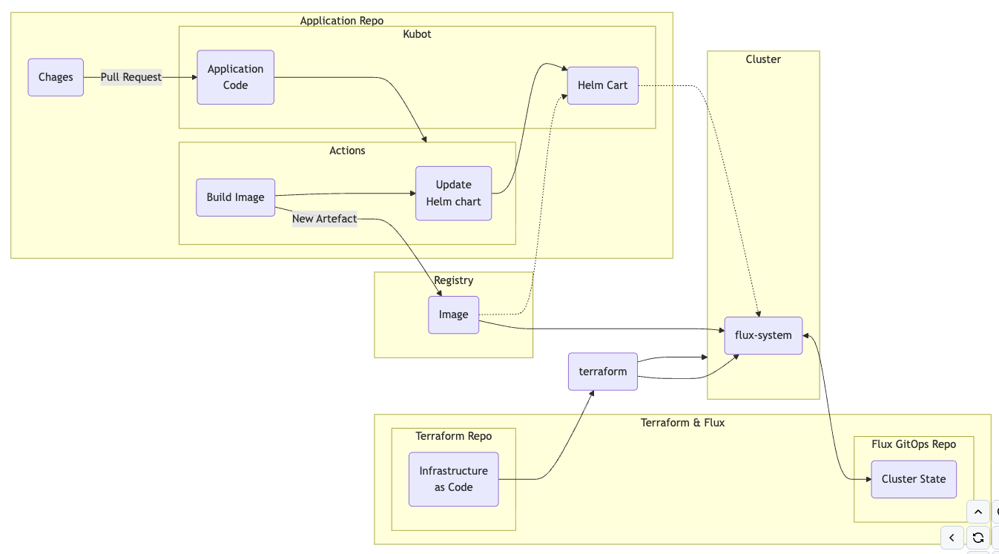

# Terraform Kubernetes+FluxCD Bootstrap

This project uses Terraform to
- create a Kubernetes cluster
- set up a Github repository to store Kubernetes manifests
- bootstrap the cluster using FluxCD

## Pre-requisites

- Terraform installed (version >= 1.15.2)
- AWS Platform account
- Github account
- FluxCD CLI

## Terraform modules used
### `k8s`
Creates a AWS EKS Kubernetes cluster with Managed Node Group along with required VPC/Subnets/Roles
### `tls_private_key`
Creates a TLS private key and self-signed certificate, exports the private key in PEM format and the public key in OpenSSH format.
### `github-repository`
Creates a private Github repository, provision deploy key passed from the `tls_private_key` module.
### `fluxcd`
Installs Flux in the Kubernetes cluster and sets it up to read manifests from the Github repository created by the `github-repository` module. It also generates a private key for Flux to use to authenticate with Github.

## Configuration
Export variables:
```
export TF_VAR_GITHUB_OWNER=
export TF_VAR_GITHUB_TOKEN=
export TF_VAR_FLUX_GITHUB_REPO=
```

## Usage
```shell
terraform init
terraform apply
export KUBECONFIG=$(terraform output -raw kubeconfig_path)
kubectl get nodes
kubectl -n flux-system get all
```
# FluxCD operations

## Flux GitOps Helm-based flow

`Git repo (github) → GitRepository (source) → Kustomization (reconciler) → HelmRelease → Helm controller -> Kubernetes API -> Deployment/Pods`

GitRepository (kind: GitRepository): clones Git repo, pulls changes every interval, produces an “artifact”

Kustomization (kind: Kustomization): points to a path in Git repo, runs kustomize build, applies manifests to cluster, handles pruning (delete removed resources). Applies ./clusters/$CLUSTER_NAME from repo.

## Install CLI
```
brew install fluxcd/tap/flux
```
## Generate and push manifests to FluxCD repo under $FLUX_GITHUB_REPO/cluster/$CLUSTER_NAME/
#### kbot-gr.yaml
```
flux create source git kbot \
  --url=https://github.com/dmzopi/kbot \
  --branch=main \
  --namespace=demo \
  --export
```  
#### kbot-hr.yaml
```
flux create helmrelease kbot \
    --namespace=demo \
    --source=GitRepository/kbot \
    --chart="./helm" \
    --interval=1m \
    --export
```
Watch logs for reconcilation
```
flux logs -f
```
Verify installed components
```
flux get -A all
```
Specifically gitrepo, helmreleases must exist
```
kubectl get gitrepository -A
NAMESPACE     NAME          URL                                      AGE     READY   STATUS
demo          kbot          https://github.com/dmzopi/kbot           6m11s   True    stored artifact for revision 'main@sha1:9560bb1b7b88875b64ab99b6f1baebce9f853887'
flux-system   flux-system   ssh://git@github.com/dmzopi/fluxcd.git   65m     True    stored artifact for revision 'main@sha1:2c9b772e9566bd84e319f51ff3d7b98d904d2901'

kubectl get kustomizations -A
NAMESPACE     NAME          AGE   READY   STATUS
flux-system   flux-system   61m   True    Applied revision: main@sha1:2c9b772e9566bd84e319f51ff3d7b98d904d2901

kubectl get helmreleases -A
NAMESPACE   NAME   AGE     READY     STATUS
demo        kbot   5m55s   Unknown   Running 'upgrade' action with timeout of 5m0s
```

## General CI/CD layout



## ToDO:
- tfstate backend -> s3 
- AWS ELB provision

## License
MIT License. See LICENSE for full details.